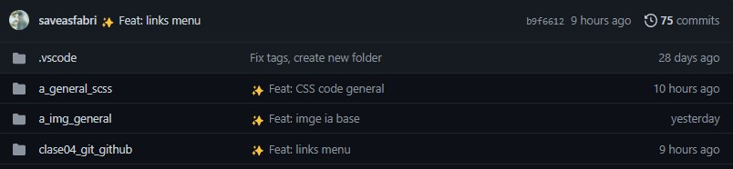
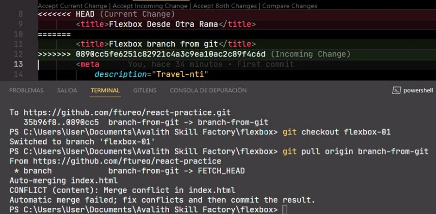

#SKIL FACTORY - AVALITH
------------------------------
## :book:Clase 4 - 15-07
[youtube.com/watch?v=7WMTkra6xKg&list=PLJPvCr6dK-cmOZSKyBMiQwptaQb30wqHl&index=4](https://www.youtube.com/watch?v=7WMTkra6xKg&list=PLJPvCr6dK-cmOZSKyBMiQwptaQb30wqHl&index=4)

<section class="theme-guide">
  <h3 class="title-theme">Temas:</h3>
  <ul>
    <li>Git</li>
    <li>Configuración de credenciales de Git</li>
    <li>Secuencias sugeridas</li>
    <li>Buenas prácticas para commits</li>
  </ul>
</section>

<!-- ********************************* Main ********************************* -->
<section class="topics-container">
  <h3 class="title-topics">
    Git
  </h3>
  <ul class="ul-topics">
    <li>
      
        <a href="https://git-scm.com/" class="link-definition" target="_blank">Git</a> es un software de control de versiones diseñado por Linus Torvalds, pensando en la eficiencia, la confiabilidad y compatibilidad del mantenimiento de versiones de aplicaciones cuando estas tienen un gran número de archivos de código fuente. Su propósito es llevar registro de los cambios en archivos de computadora incluyendo coordinar el trabajo que varias personas realizan sobre archivos compartidos en un repositorio de código.
      
    </li>
    <li>
      Es necesario configurar las credenciales de forma inicial para que Git pueda hacer login
      

        
git config /-global user.name [your_name]

        
git config /-global user.email [your_email]

      

    </li>
    <li>
      Comandos esenciales
      

        
git init - Sirve para iniciar un nuevo repositorio en local

        
git status - Sirve para controlar el estado de nuestro repositorio

        
git add - Sirve para agregar cambios a nuestro staging

        
git checkout [branch] - Sirve para movernos de una rama a otra

        
git commit -m [message] - Sirve para escribir un mensaje en el cambio que queremos versionar

        
git push [main] - Sirve para enviar los cambios desde el repo local al repo remoto

        
git remote update origin --prune - Sirve para traer todas las ramas remotas hacia el repositorio local

        
git branch - Sirve para ver las ramas disponibles en el repositorio

        
git remote -v - Sirve para ver la dirección del repositorio remoto vinculado

        
git remote add origin [url] - Sirve para vincular el repo local a un repo remoto

        
git clone [url] - Sirve para clonar un repositorio remoto a nuestro equipo

      
          
    </li>
    <li>
      Secuencias sugeridas
      

        
git init - Creo el repositorio

        
Voy a GitHub / GitLab y me creo un repositorio remoto

        
git remote add origin [url] - Agrego la URL del repositorio remoto

        
git remote -v - Veo que se haya creado la referencia remota para mi repo local

      

    </li>
    <li>
      Buenas prácticas para commits
      

        
Si querés agregar iconos en los mensajes de tus commits, esto puede servirte:

        
" <a href="https://gist.github.com/parmentf/035de27d6ed1dce0b36a" class="link-definition" target="_blank">https://gist.github.com/parmentf/035de27d6ed1dce0b36a</a> "

        
        
        
Buenos consejos... de buenas prácticas:

        
Midudev: " <a href="https://midu.dev/buenas-practicas-escribir-commits-git/" class="link-definition" target="_blank">midu.dev/buenas-practicas-escribir-commits-git/</a> "

        
Códigofacilito: " <a href="https://codigofacilito.com/articulos/buenas-practicas-en-commits-de-git" class="link-definition" target="_blank">codigofacilito.com/articulos/buenas-practicas-en-commits-de-git</a> "

        
Medium: " <a href="https://medium.com/@jmz12/buenas-pr%C3%A1cticas-para-commits-5eb4c86b9a47" class="link-definition" target="_blank">medium.com/@jmz12/buenas-pr%C3%A1cticas-para-commits-5eb4c86b9a47</a> "

      

    </li>
    <li>
      Otros comandos
      

        
git pull origin [branch] - Sirve para traer la información desde una determinada rama

        
git merge - Sirve para combinar los cambios entre dos ramas

        
Hacer merge entre dos ramas puede generar conflictos que debemos resolver para concretar la fusión

        
Así se vé un "merge conflict"

        
      

    </li>
  </ul>
</section>

__Repositorio :__
[github.com/saveasfabri/react_sf_avalith/tree/main/clase04_git_github](https://github.com/saveasfabri/react_sf_avalith/tree/main/clase04_git_github)