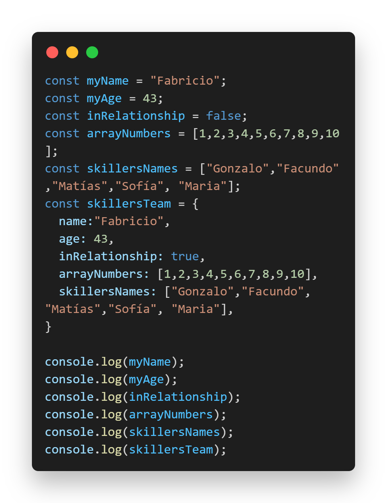

#SKIL FACTORY - AVALITH
------------------------------
## :book:Clase 5 - 18-07
[youtube.com/watch?v=hrmUlHgMbKE&list=PLJPvCr6dK-cmOZSKyBMiQwptaQb30wqHl&index=5](https://www.youtube.com/watch?v=hrmUlHgMbKE&list=PLJPvCr6dK-cmOZSKyBMiQwptaQb30wqHl&index=5)

### Introducción a JavaScript

##### EJERCICIO 1 :
- Creación de variables
- Creación de variable que contiene un array
- Creación de variable que contiene un objeto
- Imprimir variables en Consola

__Repositorio :__
[github.com/saveasfabri/react_sf_avalith/tree/main/clase05_intro_js](https://github.com/saveasfabri/react_sf_avalith/tree/main/clase05_intro_js)

Puede clonar este repositorio escribiendo en su terminal:   

>`git clone -b schema-flexbox --single-branch https://github.com/saveasfabri/react_sf_avalith/tree/main/clase05_intro_js`  