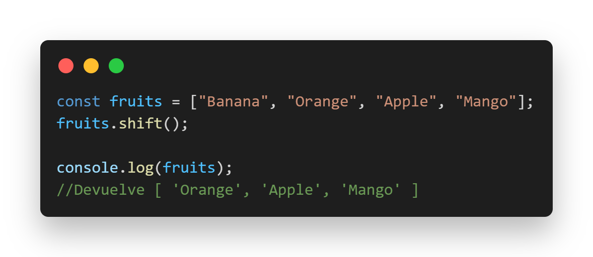
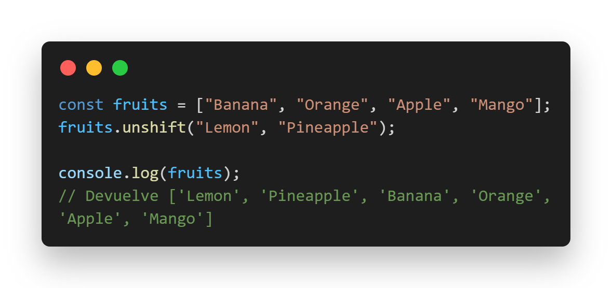
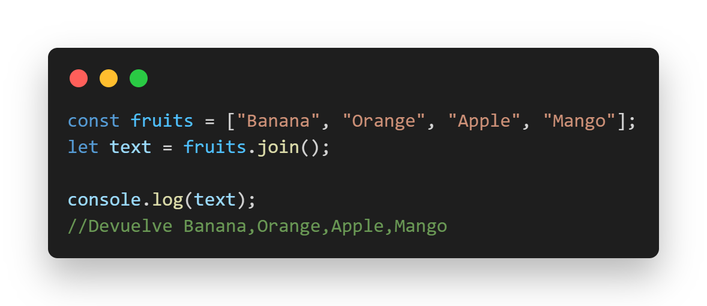
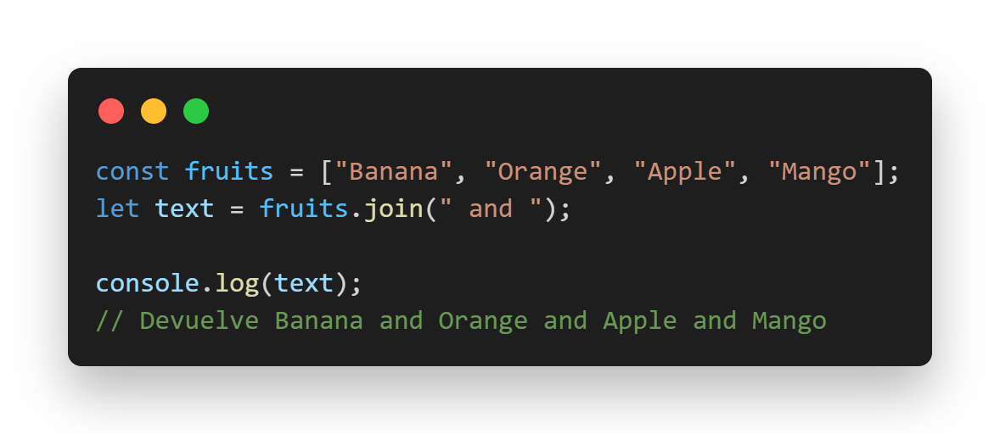
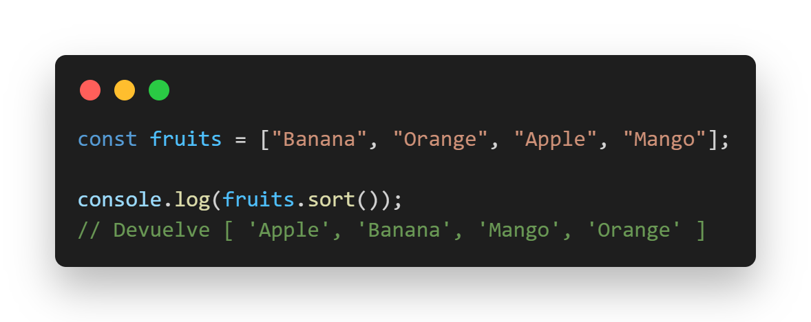

#SKIL FACTORY - AVALITH
------------------------------
## :book:Clase 6 - 20-07
[youtube.com/watch?v=bxIP647fp7A&list=PLJPvCr6dK-cmOZSKyBMiQwptaQb30wqHl&index=6](https://www.youtube.com/watch?v=bxIP647fp7A&list=PLJPvCr6dK-cmOZSKyBMiQwptaQb30wqHl&index=6)

### Métodos JavaScript

##### EJERCICIO 2 :
- Investigacion de métodos

  <a href="#pop">. pop( )</a>
  <a href="#shift">. shift( ) </a>
  <a href="#push">. push( )</a>
  <a href="#slice">. slice( )</a>
  <a href="#unshift">. unshift( )</a>

  <a href="#reverse">. reverse( )</a>
  <a href="#join">. join( )</a>
  <a href="#concat">. concat( )</a>
  <a href="#length">. length</a>
  <a href="#sort">. sort( )</a>

<section>
  

    <h5 id="pop">.pop( )</h5>
    
Cambia la matriz original 

    
El pop( ) método elimina (abre) el último elemento de una matriz.

    
    
El pop( ) devuelve el elemnto eliminado.

    
  

  
  

    <h5 id="shift">.shift( )</h5>
    
Cambia la matriz original

    
El shift( ) método elimina el primer elemento de una matriz.

    
    
El shift( ) método devuelve el elemento desplazado.

    
  

  
  

    <h5 id="push">.push( )</h5>
    
Cambia la longitud de la matriz.

    
El push( ) método agrega nuevos elementos al final de una matriz.

    
    
El push( ) método devuelve la nueva longitud.

    
  

  
  

    <h5 id="slice">.slice( )</h5>
    
No cambia la matriz original.

    
El slice( )  método devuelve los elementos seleccionados en una matriz, como una nueva matriz.

    
    
El slice() método selecciona desde un inicio dado , hasta un final dado (no inclusive) .

    
  
}
  
  

    <h5 id="unshift">.unshift( )</h5>
    
Sobrescribe la matriz original.

    
El unshift( ) método agrega nuevos elementos al comienzo de una matriz.

    
  

  
  

    <h5 id="reverse">.reverse( )</h5>
    
Sobrescribe la matriz original.

    
El reverse( ) método invierte el orden de los elementos en una matriz.

    
  

  
  

    <h5 id="join">.join( )</h5>
    
No cambia la matriz original.

    
El join( ) método devuelve una matriz como una cadena.

    
    
Se puede especificar cualquier separador. El valor predeterminado es coma (,).

    
  

  
  

    <h5 id="concat">.concat( )</h5>
    
No cambia las matrices existentes.

    
El join( ) método devuelve una matriz como una cadena.

    
    
Se puede especificar cualquier separador. El valor predeterminado es coma (,).

    
  

  
  

    <h5 id="length">.length</h5>
    
La length propiedad devuelve la longitud de una cadena.

    
La length propiedad de una cadena vacía es 0.

              
  

  
  

    <h5 id="sort">.sort( )</h5>
    
Sobrescribe la matriz original.

    
El sort( ) ordena los elementos de una matriz.

    
    
El sort( ) ordena los elementos como cadenas en orden alfabético y ascendente.

    
  

</section>

------
__Repositorio :__
[github.com/saveasfabri/react_sf_avalith/tree/main/clase06-methods_js](https://github.com/saveasfabri/react_sf_avalith/tree/main/clase06-methods_js)
