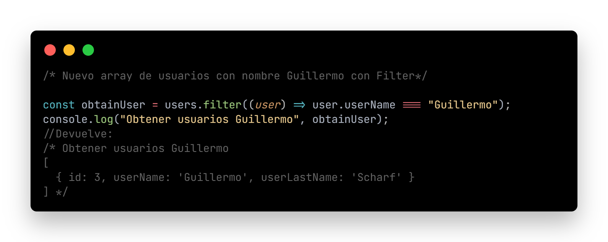
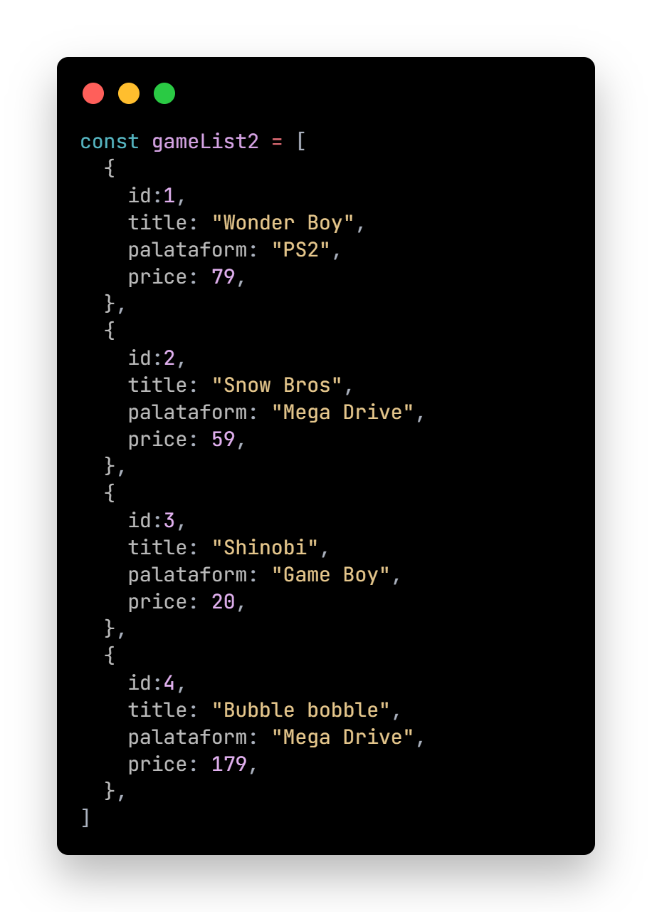
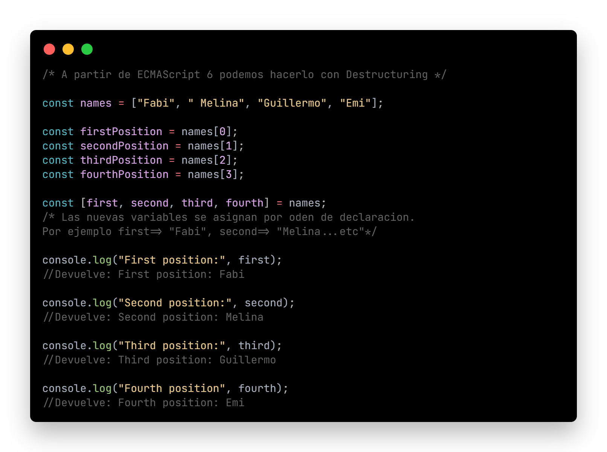
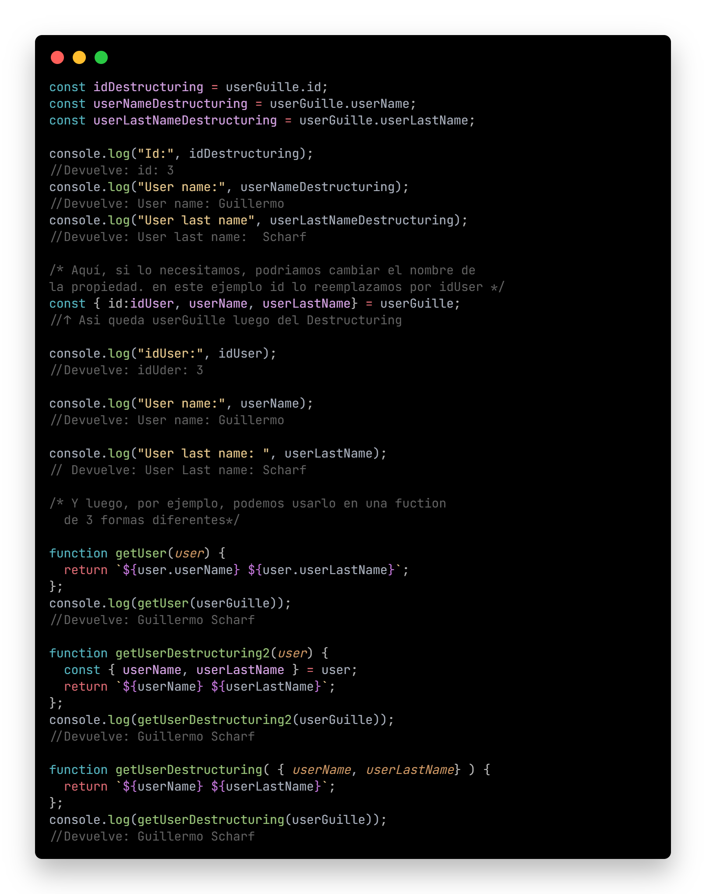

# SKIL FACTORY - AVALITH
------------------------------
## :book:Clase 9 - 29-07
[youtube.com/watch?v=Qx5Ofj1QMNc&list=PLJPvCr6dK-cmOZSKyBMiQwptaQb30wqHl&index=9](https://www.youtube.com/watch?v=Qx5Ofj1QMNc&list=PLJPvCr6dK-cmOZSKyBMiQwptaQb30wqHl&index=9)

### Funciones y Métodos 2 JavaScript

<section>
  <h5>Filter, find, destrocturing an spread operator</h5>
  <ul>
    <li>
      

        <a href="#filter">. filter( )</a>
        <a href="#find">. find( )</a>
        <a href="#dest">. Destructuring</a>
        <a href="#spread">. Spread Operator</a>
      
     
    </li>
  </ul> 

  <h5 id="filter">Método Filter</h5>
  <ul>
    <li>
      <a href="https://www.w3schools.com/jsref/jsref_filter.asp" target="_blank">Filter</a> nos permite iterar por cada elemento de un determinado array y nos devolerá otro array con la información que se corresponda con la condición que le indiquemos en el <a href="https://www.w3schools.com/js/js_callback.asp" target="_blank">callback</a> de la función.
      
 * Ver código funcional en archivo ejercicio-funciones2.js

                
                
                
    </li>
    <li>
      Filter en Acción
      
 * Ver código funcional en archivo ejercicio-funciones2.js

      
      
      
      
    </li>        
  </ul>
  
  

  <h5>Método Map y Filter</h5>
  <ul>
    <li>
      Un problema recurrente cuando solicitamos o nos llega la información desde una API y el caudal de información grande, la performance puede verse afectada por el alto costo de métodos en conjunto (si, se puede) para poder crear un algoritmo de mejor rendimiento.
      
 * Ver código funcional en archivo ejercicio-funciones2.js

                
                
    </li>
  </ul>
  
  

  <h5 id="find">Método Find</h5>
  <ul>
    <li>
      <a href="https://www.w3schools.com/jsref/jsref_find.asp" target="_blank">Find</a> similar a lo que hace Filter y Map, recorre un array dado y devuelve la primera coincidencia respecto a una condición dada. A partir de ese momento deja de recorrer el array.
      
 * Ver código funcional en archivo ejercicio-funciones2.js

      
      
    </li>
  </ul>
  
  

  <h5 id="dest">Destructuring</h5>
  <ul>
    <li>
      <a href="https://www.w3schools.com/react/react_es6_destructuring.asp" target="_blank">Destructuring</a> (Desestructuración) es una expresión de JavaScript que nos permite extraer datos de matrices, objetos y mapas y establecerlos en variables nuevas y distintas. La desestructuración nos permite extraer múltiples propiedades, o elementos, de una matriz a la vez.
      
 * Ver código funcional en archivo ejercicio-funciones2.js

      
      
      
    </li>
  </ul>
  
  

  <h5 id="spread">Spread Operator</h5>
  <ul>
    <li>
      <a href="https://www.w3schools.com/react/react_es6_spread.asp" target="_blank">Spread Operator</a> (Operador de propagación) es una nueva adición al conjunto de operadores en JavaScript ECMAScript 6. Toma un iterable (por ejemplo, una matriz) y lo expande en elementos individuales.
      Spread Operator se usa comúnmente para hacer copias superficiales de objetos JS. El uso de este operador hace que el código sea conciso y mejora su legibilidad.
      
 * Ver código funcional en archivo ejercicio-funciones2.js

      
      
    </li>
  </ul>
</section>

__Repositorio :__
[github.com/saveasfabri/react_sf_avalith/tree/main/clase09_fx_metodos2_js](https://github.com/saveasfabri/react_sf_avalith/tree/main/clase09_fx_metodos2_js)
