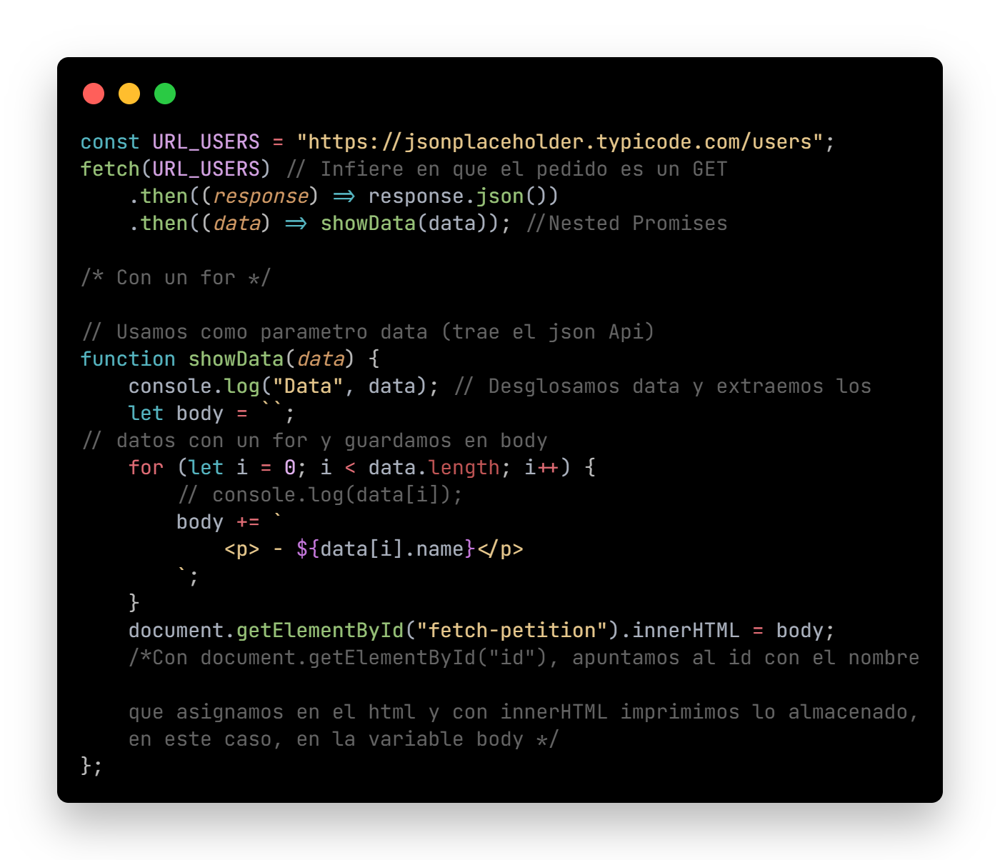
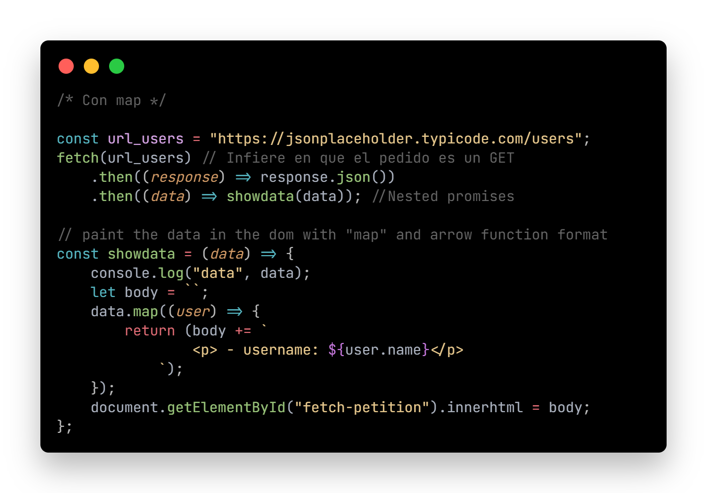
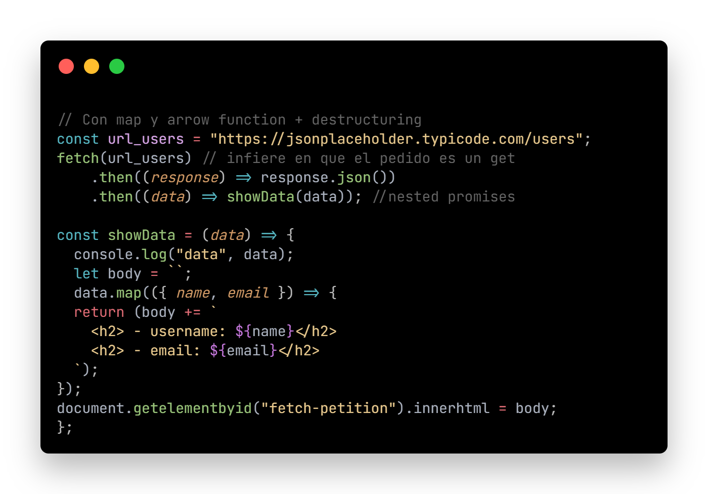

# SKIL FACTORY - AVALITH
## :book:Clase 10 - 01-08
[youtube.com/watch?v=VDsP2C55g0s&list=PLJPvCr6dK-cmOZSKyBMiQwptaQb30wqHl&index=10](https://www.youtube.com/watch?v=VDsP2C55g0s&list=PLJPvCr6dK-cmOZSKyBMiQwptaQb30wqHl&index=10)

<section class="theme-guide">
        <h4 class="title-theme">Temas:</h3>
        <ul>
          <li>Fetch</li>
          <li>Ejemplo de impresion en el DOM de datos obtenidos de una API con fetch</spa></li>
        </ul>
        <h4 class="title-theme">En archivo .js:</h3>
        <ul>
          <li>Fetch con .then()</li>
          <li>Fetch con .then() + for</li>
          <li>Fetch con .then() + map</li>
        </ul>
    </section>

---

<section class="topics-container">
      <h3 class="title-topics" id="filter">Fetch</h3>
      <ul class="ul-topics">
        <li>
          <a href="https://www.w3schools.com/jsref/api_fetch.asp" class="link-definition" target="_blank">Fetch</a> ofrece una definición genérica de los objetos <a href="https://developer.mozilla.org/es/docs/Web/API/Request" class="link-definition" target="_blank">Request</a> y <a href="https://developer.mozilla.org/es/docs/Web/API/Response" class="link-definition" target="_blank">Response</a> ( y otras cosas relacionadas con las solicitudes de red ). Esto permitirá su uso donde sea necesario en un futuro, ya sea para operadores de servicios, API caché y otras cosas similares que manipulen o modifiquen las solicitudes y respuestas, o cualquier otro tipo de caso de uso que pudiera requerirle la generación de sus propias respuestas mediante programación.     
          Veremos 3 formas distintas de lograr un mismo resultado
          
 * Ver código funcional en archivo ./js/fetch.js

                   
                   
                   
        </li>     
      </ul>
      <ul class="ul-topics">
        <li>
          Si ejecutamos el index.html en esta carpeta en un navegador, veremos el resultado en el <a href="https://www.w3schools.com/js/js_htmldom.asp" class="link-definition" target="_blank">DOM</a> en tiempo real, impreso con <a href="https://www.w3schools.com/jsref/prop_html_innerhtml.asp" class="link-definition" target="_blank">innertHTML</a> que es el mismo resultado con cualquiera de las 3 opciones arriba detalladas y se le aplica estilo con css
          

            

     
          
       
        </li>
      </ul>
    </section>

__Repositorio :__
[github.com/saveasfabri/react_sf_avalith/tree/main/clase10_fetch](https://github.com/saveasfabri/react_sf_avalith/tree/main/clase10_fetch)
