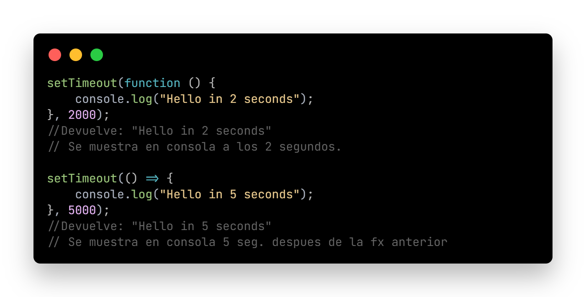

# SKIL FACTORY - AVALITH
## :book:Clase 11 - 03-08
[youtube.com/watch?v=Qx5Ofj1QMNc&list=PLJPvCr6dK-cmOZSKyBMiQwptaQb30wqHl&index=9](https://www.youtube.com/watch?v=Qx5Ofj1QMNc&list=PLJPvCr6dK-cmOZSKyBMiQwptaQb30wqHl&index=9)

#####Temas:
* setTimeOut()
* Asincronismo
* Event Loop y Call Stack
* Callback

---

<section>
      <h3>Antes de empezar: setTimeOut</h3>
      <ul>
        <li>
          El método <a href="https://www.w3schools.com/jsref/met_win_settimeout.asp" target="_blank">setTimeOut( )</a> es un temporizador. Este método permite ejecutar un <a href="https://www.w3schools.com/js/js_callback.asp" target="_blank">callback</a> luego de que haya transcurrido un determinado tiempo. Los dos parámetros más importantes a tener en cuenta son: la function a ejecutar y el time (en ms) que debe esperar para ejecutarse.
          
 * Ver código funcional en archivo ./js/asinchronism.js

                   
                   
                   
        </li>     
      </ul>  
      <h3>Asincronismo</h3>
      <ul>
        <li>
          Aprender a trabajar con <a href="https://www.w3schools.com/Js/js_asynchronous.asp" target="_blank">asincronismo</a> en JavaScript nos permitirá ejecutar tareas tengan un tiempo diferido respecto al tiempo de ejecución hasta que se consideren finalizadas.
          <ul >
            <li>JavaScript => Lenguaje Monohilo (Single-thread).</li>
            <li>Significa que solo puede hacer una tarea a la vez (secuencial).</li>
            <li>Aunque no sea multitarea (mejor llamado multi-thread), puede delegar la ejecución a otros procesos.</li>
          </ul>
          

            <h4>Modelo de concurrencia</h4>
            
(Dos o más tareas progresan simultáneamente)

            <pc>VS</pc>
            <h4>Modelo de Paralelismo</h4>
            
(Dos o más tareas ocurren simultáneamente)

            
            
          

        </li>  
        <li>
          JavaScript es un lenguaje concurrente, asíncrono, no
            bloqueante, interpretado, de alto nivel, monohilo.
        </li>      
      </ul>      
      <h3>Event Loop y Call Stack</h3>
      <ul>
        <li>
          ¿Cómo maneja el asincronismo, la concurrencia y el no-bloqueo si es single-thread?
          <h3><a href="https://medium.com/@Rahulx1/understanding-event-loop-call-stack-event-job-queue-in-javascript-63dcd2c71ecd" target="_blank">Mecanismo Event Loop</a></h3>          
          
JavaScript posee una pila de ejecución llamada Call Stack donde coloca las llamadas a funciones según el orden en que deban ejecutarse.

          
Cada línea de ejecución se lee de forma secuencial pero, cuando una función llama a otra,entonces esa tarea se agrega a la pila hasta que termina de ejecutarla y luego la elimina de la pila

        </li>
      </ul>
      <h3>Event Loop</h3>
      
      
      <h3>Callback</h3>
      <ul>
        <li>
          Un <a href="https://www.w3schools.com/js/js_callback.asp" target="_blank">callback</a> es una función que recibe como parámetro a otra función.
          
Cuando una función llama a otra función y esta última se resuelve, será agregada al Callback Queue. Esto indica que JS sigue ejecutando todas las demás tareas sincrónicas y, cuando se quede sin funciones a ejecutar en la pila de ejecución, allí
            agregará la información obtenida desde la cola de tareas

        </li>
        
 * Ver código funcional en archivo ./js/asinchronism.js

        
      </ul>
    </section>

__Repositorio :__
[github.com/saveasfabri/react_sf_avalith/tree/main/clase11_asinchronism__js](https://github.com/saveasfabri/react_sf_avalith/tree/main/clase11_asinchronism__js)
