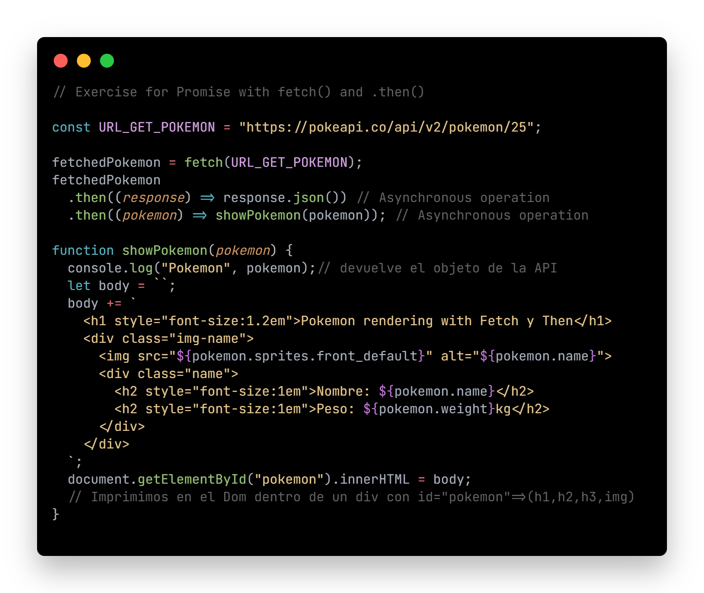
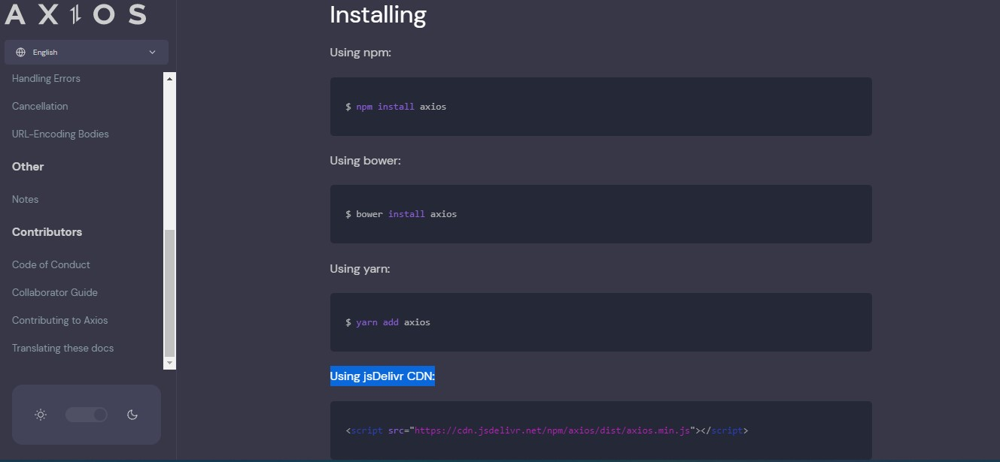
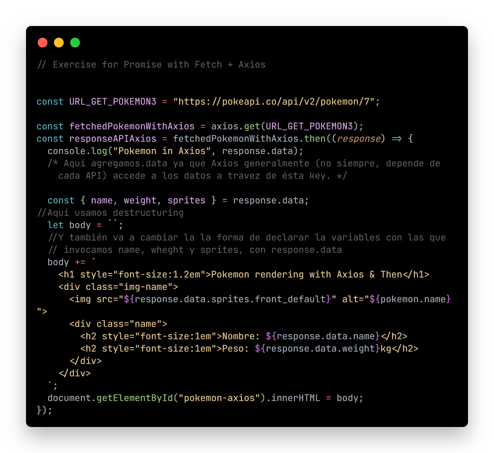

# SKIL FACTORY - AVALITH
------------------------------
## :book:Clase 12 - 05-08
[youtube.com/watch?v=Wwy0ASFa0qk&list=PLJPvCr6dK-cmOZSKyBMiQwptaQb30wqHl&index=12](https://www.youtube.com/watch?v=Wwy0ASFa0qk&list=PLJPvCr6dK-cmOZSKyBMiQwptaQb30wqHl&index=12)

<section>
      <h3>Temas:</h3>
      <ul>
        <li>Fetch + Then</li>
        <li>Async/Await</li>
        <li>Axios</li>
      </ul>
      <h3>En archivo .js:</h3>
      <ul>
        <li>Ejemplos con API Pókemon</li>
        <li>Promesa con fetch( ) + then( )</li>
        <li>Promesa con fetch( ) + Async/Await</li>
        <li>Promesa con fetch( ) + Axios</li>
      </ul>
    </section>
    ***************************************************************    
    <section>
      <h3>Ejemplos con API Pókemon</h3>
      <ul>
        <li>
          fetch( ) + then( )
          
 * Ver código funcional en archivo ./js/asinchronism2.js

                   
          <ul>
            <li>Abajo se muestra el código anterior impreso en el DOM con JS y CSS</li>
          </ul>
          

          
        </li>     
      </ul>
      <ul>
        <li>
          fetch( ) + Async/Await( )
          
 * Ver código funcional en archivo ./js/asinchronism2.js

          
          <ul>
            <li>Abajo se muestra el código anterior impreso en el DOM con JS y CSS</li>
          </ul>
          

          
        </li>     
      </ul>
      <ul>
        <li>
          Fetch( ) + Axios( )
          
<a href="https://www.w3schools.com/jsref/met_win_settimeout.asp">Axios</a> es una líbreria de JS. Para poder usarla nos dirigimos a la pagina web de Axios ( <a href="https://www.w3schools.com/jsref/met_win_settimeout.asp">https://axios-http.com/docs/intro</a> ). Como no estamos usando node.js en este ejemplo, vamos a agregarla copiando la etiqueta script de CDN jsDelivr 

          
          
Y lo agregamos en el html por encima de los demás script

          
          
 * Ver código funcional en archivo ./js/asinchronism2.js

          
          <ul>
            <li>Abajo se muestra el código anterior impreso en el DOM con JS y CSS</li>
          </ul>
          

          
        </li>     
      </ul>
    </section>

__Repositorio :__
[github.com/saveasfabri/react_sf_avalith/tree/main/clase12_fetch_async_await_axios](https://github.com/saveasfabri/react_sf_avalith/tree/main/clase12_fetch_async_await_axios)
