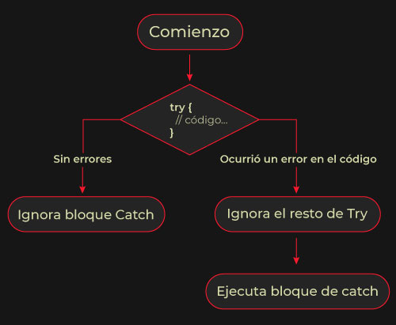
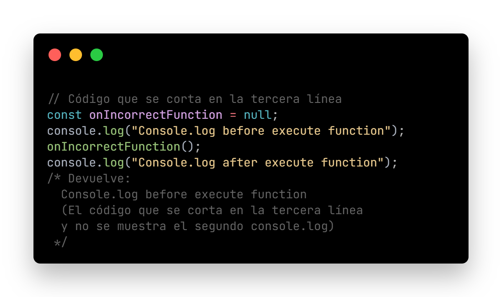
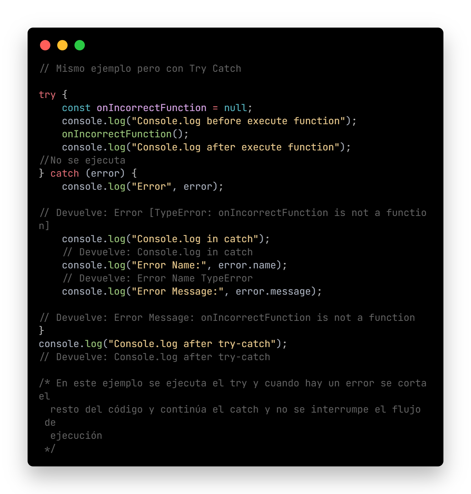

# SKIL FACTORY - AVALITH
------------------------------
## :book:Clase 13 - 08-08
[youtube.com/watch?v=9KHlwgLJ7ww&list=PLJPvCr6dK-cmOZSKyBMiQwptaQb30wqHl&index=13](https://www.youtube.com/watch?v=9KHlwgLJ7ww&list=PLJPvCr6dK-cmOZSKyBMiQwptaQb30wqHl&index=13)

<section class="theme-guide">
  <h3 class="title-theme">Temas:</h3>
  <ul>
    <li>Errores</li>
    <li>Qué genera un error</li>
    <li>Try Catch</li>
  </ul>
  <h3 class="title-theme">En archivo .js:</h3>
  <ul>
    <li>Ejemplos con Try Catch</li>
    <li>Ejemplo Try Catch con API Pókemon</li>
  </ul>
</section>

<section class="topics-container">
  <h3 class="title-topics">Errores</h3>
  <ul class="ul-topics">
    <li>
      Cuando aprendemos a trabajar con asincronismo y a entender de menor a mayor nivel el funcionamiento del Event Loop, podemos ver que pueden llegar a aparecer errores.
      
Además, siempre debemos considerar si los tipos de datos o las funciones están bien desarrolladas ya que un algoritmo mal ideado puede trabar el hilo de ejecución.
          
    </li>     
  </ul>
  <h3 class="title-topics">Qué genera un error</h3>
  <ul class="ul-topics">
    <li>
      Una falla con el servidor que provee el servicio.
    </li>     
    <li>
      Un ingreso inesperado por parte de nuestro grupo de users.          
    </li>     
    <li>
      Un algoritmo pensado incorrectamente.
    </li>     
  </ul> 

  <h3 class="title-topics">Try catch</h3>
  <ul class="ul-topics">
    <li>
      Son dos bloques de código que nos permitirán controlar la forma en que se ejecuta nuestro script.
    </li>     
    <li>
      Dentro del <a href="https://developer.mozilla.org/es/docs/Web/JavaScript/Reference/Statements/try...catch" class="link-definition" target="_blank">Try</a> guardaremos el código que intentaremos que se ejecute para lograr un comportamiento.          
    </li>     
    <li>
      Dentro del <a href="https://developer.mozilla.org/es/docs/Web/JavaScript/Reference/Statements/try...catch" class="link-definition" target="_blank">Catch</a> capturaremos los errores y los manipularemos.
    </li>     
    <li>
      Si pasa el Try, ignora lo que contenga el Catch.
    </li>    
    
    <li>
      El Catch será quien se encargue de ejecutar una fracción de código que está realizada con el error. Al menos cuenta con dos propiedades: name y message. Generalmente, son un buen punto de partida para pensar en la <a href="https://developer.mozilla.org/es/docs/Glossary/UX" class="link-definition" target="_blank">UX</a>. 
      
      
También podemos gestionar un nuevo error a través de <a href="https://developer.mozilla.org/es/docs/Web/JavaScript/Reference/Statements/throw" class="link-definition" target="_blank">throw new Error</a>. 
      

    </li>    
  </ul>
  
 * Ver código funcional en archivo ./js/asinchronism3.js

  
  
  
</section>

__Repositorio :__
[github.com/saveasfabri/react_sf_avalith/tree/main/clase13_try-catch](https://github.com/saveasfabri/react_sf_avalith/tree/main/clase13_try-catch)
