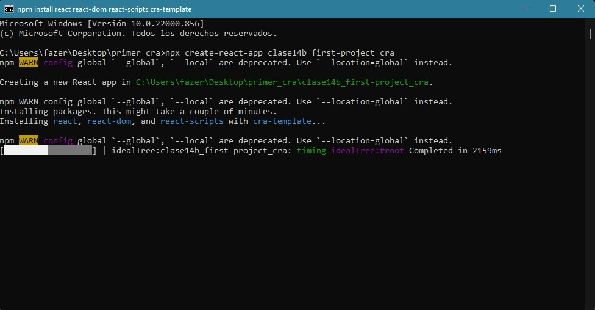
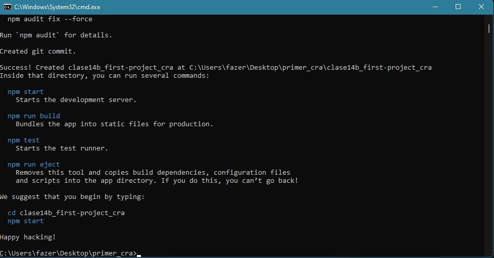

# SKIL FACTORY - AVALITH
------------------------------
## :book:Clase 14 - 12-08
[youtube.com/watch?v=gjAr9Y461h8&list=PLJPvCr6dK-cmOZSKyBMiQwptaQb30wqHl&index=14](https://www.youtube.com/watch?v=gjAr9Y461h8&list=PLJPvCr6dK-cmOZSKyBMiQwptaQb30wqHl&index=14)

<section class="theme-guide">
  <h3 class="title-theme">Temas:</h3>
  <ul>
    <li>Intro a React</li>
    <li>Creando un proyecto con CRA</li>
    <li>Creando un proyecto con VITE</li>
  </ul>
</section>

<section class="topics-container">
  <h3 class="title-topics">Intro a React</h3>
  <ul class="ul-topics">
    <li>
      Es una librería creada por Facebook para el Front End. 
    </li>     
    <li>
      Su primer release fue lanzada en Mayo 2013.
    </li>     
    <li>
      Su propósito principal es facilitar la tarea de crear interfaces de usuarios.
    </li>     
    <li>
      Propone el concepto de "Reactivo a los cambios".
    </li>     
  </ul>
</section>

<section class="topics-container">
  <h3 class="title-topics">Creando un proyecto con CRA</h3>
  <ul class="ul-topics">
    <li>
      
        CRA es el acrónimo correspondiente a <a href="https://create-react-app.dev/" class="link-definition" target="_blank">Create React App</a>. Es el comando que la librería trae de forma natural para poder crear un proyecto de React. Como sabemos que esto depende de Node, entonces es posible utilizar NPM para manejar los paquetes.
      
      

        (En este caso, utilizaremos uno muy parecido que se llama <a href="https://medium.com/@maybekatz/introducing-npx-an-npm-package-runner-55f7d4bd282b" class="link-definition" target="_blank">NPX</a> que no es más que un NPM pero ejecutable).
      

    </li>
    <li>
      
        Veamos cómo crear un proyecto con CRA:
      
      <ul class="sub-ul-topics">
        <li>
          Tomamos una ubicación en el Explorador de archivos para crear, luego, la carpeta raiz del proyecto con npx desde la consola. En la barra de direccion al hacer click cambia y queda seleccionado mostrando, en este ejemplo la dirección "C:\Users\fazer\Desktop\react_sf_avalith".
        </li>
         
        <li>
          Mientras esta seleccionada la dirección, escribimos cmd para abrir la consola.
        </li>
         
        <li>
          En la consola, verificando que estamos en la ubicación correcta en la que queremos crear el proyecto (en este caso dentro de react_sf_avalith) y escribimos "npx create-react-app [nombre_de_proyecto]". Aquí usaremos "clase14b_first-project_cra", y damos enter.
        </li>
         
        <li>
          Al terminar de ejecutarce (demora bastante) nos aparecerá el mensaje al final "Happy Hacking".
        </li>
         
        <li>
          Luego, ya podemos abrir el proyecto en VS Code. Desde la terminal verificamos que estemos posicionados en la carpeta de dicho proyecto y ejecutamos "npm start" (En este ejemplo: PS C:\Users\fazer\Desktop\react_sf_avalith\clase14b_first-project_cra> npm start),al darle enter iniciará nuestro proyecto en un servidor y abrirá una vista previa en el navegador. 
        </li>
         
        <li>
          Y en nuestra terminal quedará un mensaje de "Compiled successfully" confirmando la ejecución. Para continuar operando en la consola, saldremos de este mensaje escribiendo ctrl+C
        </li>
         
        <li>
          El siguiente paso es ssociar un repositorio en Github al que crea automáticamente el CRA. Es recomendable usar siempre el mismo nombre que le asignamos al proyecto(En este caso "clase14b_first-project_cra").
        </li>
         
        <li>
          Copiamos el siguiente codigo en Github.
        </li>
         
        <li>
          Lo pegamos en la terminal del proyecto y le damos enter .
        </li>
         
        <li>Si bien el proceso de CRA genera un primer commit, no está demás generar uno propio y probar el repositorio(En este ejemplo: git commit -m ":sparkles: feat: Add React project - First Class"). Luego hacemos git push origin master para subirlo a nuestro repositorio.
        </li>
         
        
*** Si quisieramos usar un proyecto de React subido a un repositorio de Github, deberiamos clonar ese repositorio en nuestro local y antes de empezar deberiamos inatalar las dependencias de npm, ya que éstos no se suben al repositorio remoto por estar agregados al archivo .gitignore ("npm install"). Luego hacemos el "npm start"

        </li>
      </ul>
    </li>
  </ul>       
</section>

<section class="topics-container">
  <h3 class="title-topics">Creando un proyecto con VITE</h3>
  <ul class="ul-topics">
    <li>
      <a href="https://vitejs.dev/guide/" class="link-definition" target="_blank">Vite</a> se define como una herramienta de frontend que te ayudará a crear tus proyectos de forma agnóstica (sin atarte a ningún framework concreto) y que su desarrollo y construcción final sea lo más sencilla y cómoda posible. Está desarrollada por <a href="https://evanyou.me/" class="link-definition" target="_blank">Evan You</a>, el creador de Vue.
      Actualmente, Vite soporta la creación tanto de proyectos vanilla (sin utilizar frameworks), como proyectos utilizando Vue, React, Preact, Svelte o Lit (tanto usando Javascript como Typescript).
    </li>
    <li>
      Vamos a crear un proyecto con Vite:
      <ul class="sub-ul-topics">
        <li>
          Para crear un proyecto completo con Vite en lugar de CRA, abriremos la consola dentro de la ubicación donde queremos crearlo (de la misma forma que se realiza en el método CRA) y escribiremos "npm init vite@latest [nombre-de-mi-proyecto]"
        </li>
        <li>
          Dentro de la carpeta del proyecto, instalamos las dependencias npm install.
            Ahora lanzamos nuestra aplicación con npm run dev.
        </li>
      </ul>
    </li>
  </ul>     
</section>

__Repositorio :__
[github.com/saveasfabri/react_sf_avalith/tree/main/clase14_intro-react](https://github.com/saveasfabri/react_sf_avalith/tree/main/clase14_intro-react)
